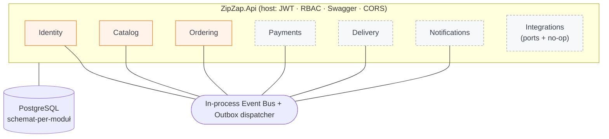
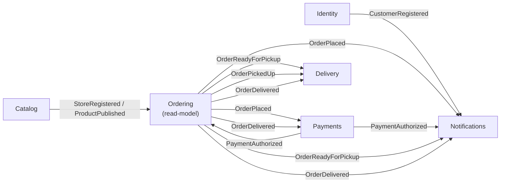

<!-- markdownlint-disable MD033 -->
<p align="center">
  
</p>

# ZipZap

Marketplace do zamawiania zakupów z **lokalnych sklepów** z dostawą.
Model: sklep płaci **prowizję** od wartości koszyka, klient płaci **osobną opłatę za dostawę**.

> **Start celowo mały:** 1 miejscowość, 2–3 sklepy, 1–2 kierowców.
> Architektura zaprojektowana pod skalę (tysiące sklepów, miliony użytkowników),
> ale **bez przedwczesnej infrastruktury** — skalujemy bez przepisywania od zera.

---

## Architektura

Backend to **modularny monolit** na .NET 8 — jeden deployment, twarde granice modułów.

**Zasady granic (egzekwowane w kodzie):**
- Każdy moduł ma **własny schemat PostgreSQL** + własny `DbContext` + własne migracje.
- **Brak** cross-schema FK i wspólnych tabel; odwołania do innych modułów **tylko po ID**.
- Komunikacja między modułami **wyłącznie** przez zdarzenia integracyjne na **event busie**
  (kontrakty w osobnym projekcie `ZipZap.Contracts` — moduły nie zależą od siebie nawzajem).
  Szyna jest wymienna: **RabbitMQ** (topic exchange `zipzap.events` + kolejka `zipzap.monolith`)
  gdy skonfigurowany host, w innym wypadku **in-process** (lokalnie/testy) — moduły bez zmian
  (wołają tylko `IEventBus` / `IIntegrationEventHandler`).
- **Outbox pattern** — zdarzenia zapisywane w tej samej transakcji co zmiana domenowa (niezawodność).
- **Multi-tenancy od 1. dnia** — każda encja niesie `StoreId` (row-level).
- **JWT + refresh token**, RBAC: `CUSTOMER`, `STORE_EMPLOYEE`, `DRIVER`, `ADMIN`.

### Moduły

| Moduł | Odpowiedzialność | Schemat | Status |
|---|---|---|---|
| **Identity** | Użytkownicy, JWT + refresh, role (RBAC) | `identity` | ✅ pełny |
| **Catalog** | Sklepy, kategorie, produkty | `catalog` | ✅ pełny |
| **Ordering** | Koszyk, zamówienie, statusy, strefy + sloty, prowizja | `ordering` | ✅ pełny + testy |
| **Payments** | Płatność (mock), księga prowizji | `payments` | 🟡 szkielet |
| **Delivery** | Projekcja cyklu dostawy | `delivery` | 🟡 szkielet |
| **Notifications** | Powiadomienia (mock kanał) | `notifications` | 🟡 szkielet |
| **Integrations** | Porty `IFiscalPrinterDriver` / `IPosConnector` + no-op | — | 🟡 tylko porty |

### Diagram modułów



### Choreografia zdarzeń (cykl zamówienia)



Ordering utrzymuje **lokalny read-model** produktów/sklepów budowany ze zdarzeń Catalog — dzięki temu
przy składaniu zamówienia ma autorytatywną cenę i prowizję **bez** sięgania do schematu `catalog`.

### Maszyna stanów zamówienia

```
DRAFT(koszyk) → PLACED → CONFIRMED → PICKING → READY_FOR_PICKUP → IN_DELIVERY → DELIVERED → COMPLETED
                   └──────────────── CANCELLED (do momentu odbioru) ───────────────┘
```
`PLACED → CONFIRMED` następuje automatycznie po `PaymentAuthorized` (mock bramki płatności).

## Struktura repo (monorepo)

```
/backend
  /src
    ZipZap.Api                 # host: DI, auth, Swagger, migracje przy starcie
    ZipZap.BuildingBlocks      # event bus, outbox, multi-tenancy, Result/Error, migrator
    ZipZap.Contracts           # published language (zdarzenia integracyjne)
    /Modules                   # Identity · Catalog · Ordering · Payments · Delivery · Notifications · Integrations
  /tests
    ZipZap.Modules.Ordering.Tests   # testy jednostkowe domeny Ordering
/admin-panel                   # Angular (logowanie + lista zamówień sklepu)
/mobile                        # Flutter (klient) — osobny etap
/branding                      # logo, paleta, typografia
docker-compose.yml
```

## Uruchomienie lokalne

### Wymagania
- **Docker** (backend + PostgreSQL). Opcjonalnie **.NET 8 SDK** i **Node 20+** do developmentu.

### Cała platforma (Docker)
```bash
cp .env.example .env          # opcjonalnie — domyślne wartości działają
docker compose up --build
```
- API: http://localhost:5080 · health: `/health` · **Swagger: http://localhost:5080/swagger**
- PostgreSQL: `localhost:5432` (`zipzap` / `zipzap` / `zipzap`)
- **RabbitMQ**: AMQP `localhost:5672` · panel zarządzania http://localhost:15672 (`zipzap` / `zipzap`)
- Migracje wszystkich modułów wykonują się automatycznie przy starcie API.
- W trybie Development zakładany jest domyślny admin: **`admin@zipzap.local` / `Admin123!`**.

### Panel administracyjny (Angular)
```bash
cd admin-panel
npm install
npm start                     # http://localhost:4200
```

### Backend bez Dockera (wymaga .NET 8 SDK)
```bash
docker compose up -d postgres
cd backend
dotnet run --project src/ZipZap.Api
```

### Testy
```bash
cd backend
dotnet test
```

## Szybki przegląd API

| Obszar | Przykłady |
|---|---|
| **Identity** | `POST /api/identity/register` · `login` · `refresh` · `GET /me` |
| **Catalog** (publiczne odczyty) | `GET /api/catalog/stores` · `/stores/{id}/products` |
| **Catalog** (zarządzanie) | `POST /api/catalog/stores` (Admin) · `/stores/{id}/products` (StoreEmployee) |
| **Ordering** | `POST /api/ordering/carts` → `/items` → `/checkout` · `POST /orders/{id}/{ready\|delivered\|…}` |
| **Payments** | `GET /api/payments/stores/{id}/commission` |
| **Delivery** | `GET /api/delivery/available` (Driver) |
| **Notifications** | `GET /api/notifications` (Admin) |
| **Integrations** | `GET /api/integrations/drivers` (Admin) |

## Marka
Kolory: pomarańcz `#F97316`, zieleń `#22C55E`, grafit `#3A3F4B`. Zasoby: [`/branding`](branding/README.md).

## Roadmapa MVP
1. ✅ Fundament: struktura, BuildingBlocks (event bus + outbox), docker-compose, branding
2. ✅ Identity — rejestracja/logowanie, JWT + refresh, role
3. ✅ Catalog — sklepy, kategorie, produkty
4. ✅ Ordering — koszyk, zamówienie, statusy, strefy + sloty, prowizja + testy
5. ✅ Szkielety (Payments/Delivery/Notifications/Integrations) + panel Angular + README z diagramem

**Dalej:** aplikacja mobilna Flutter (klient), realne integracje (kasy fiskalne, POS/ERP),
realna bramka płatności, rozbudowa panelu. *(Broker komunikatów — RabbitMQ — już zintegrowany.)*
