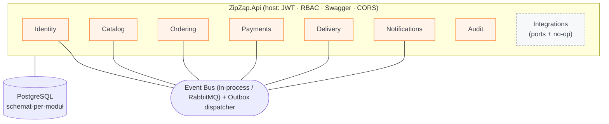
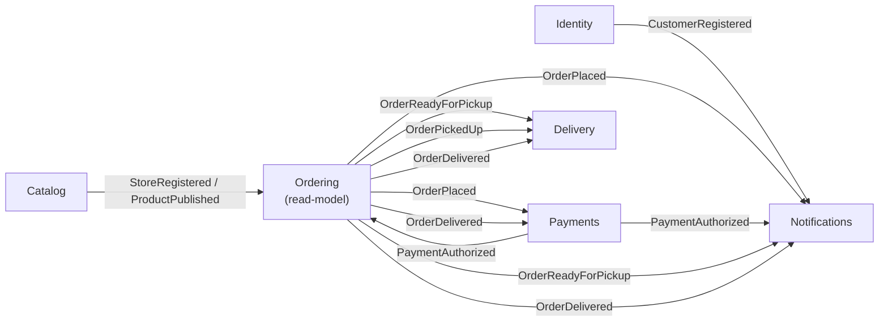

<!-- markdownlint-disable MD033 -->
<p align="center">
  
</p>

# ZipZap

Marketplace do zamawiania zakupów z **lokalnych sklepów** z dostawą.
Model: sklep płaci **prowizję** od wartości koszyka, klient płaci **osobną opłatę za dostawę**.

> **Start celowo mały:** 1 miejscowość, 2–3 sklepy, 1–2 kierowców.
> Architektura zaprojektowana pod skalę (tysiące sklepów, miliony użytkowników),
> ale **bez przedwczesnej infrastruktury** — skalujemy bez przepisywania od zera.

---

## Architektura

Backend to **modularny monolit** na .NET 8 — jeden deployment, twarde granice modułów.

**Zasady granic (egzekwowane w kodzie):**
- Każdy moduł ma **własny schemat PostgreSQL** + własny `DbContext` + własne migracje.
- **Brak** cross-schema FK i wspólnych tabel; odwołania do innych modułów **tylko po ID**.
- Komunikacja między modułami **wyłącznie** przez zdarzenia integracyjne na **event busie**
  (kontrakty w osobnym projekcie `ZipZap.Contracts` — moduły nie zależą od siebie nawzajem).
  Szyna jest wymienna: **RabbitMQ** (topic exchange `zipzap.events` + kolejka `zipzap.monolith`)
  gdy skonfigurowany host, w innym wypadku **in-process** (lokalnie/testy) — moduły bez zmian
  (wołają tylko `IEventBus` / `IIntegrationEventHandler`).
- **Outbox pattern** — zdarzenia zapisywane w tej samej transakcji co zmiana domenowa (niezawodność).
- **Multi-tenancy od 1. dnia** — każda encja niesie `StoreId` (row-level).
- **JWT + refresh token**, RBAC: `CUSTOMER`, `STORE_EMPLOYEE`, `DRIVER`, `ADMIN`.

### Moduły

| Moduł | Odpowiedzialność | Schemat | Status |
|---|---|---|---|
| **Identity** | Użytkownicy, JWT + refresh, role (RBAC), Google, reset hasła, zespół sklepu | `identity` | ✅ pełny |
| **Catalog** | Sklepy (status, prowizja, min-order), kategorie, produkty | `catalog` | ✅ pełny |
| **Ordering** | Koszyk, zamówienie, statusy, strefy + sloty, prowizja, idempotencja | `ordering` | ✅ pełny + testy |
| **Payments** | Płatność **webhook-autorytatywna** (abstrakcja + mock), księga prowizji, rozliczenia | `payments` | ✅ pełny + testy |
| **Delivery** | Workflow kierowcy (pula → przyjmij → odbierz → dostarcz), izolacja | `delivery` | ✅ pełny |
| **Notifications** | Rozwiązywanie odbiorcy, skrzynka in-app, abstrakcja push (FCM) + mock | `notifications` | ✅ pełny |
| **Audit** | Rejestr akcji administracyjnych (kto/co/na czym/kiedy) | `audit` | ✅ pełny |
| **Integrations** | Porty `IFiscalPrinterDriver` / `IPosConnector` + no-op | — | 🟡 tylko porty |

### Diagram modułów



### Choreografia zdarzeń (cykl zamówienia)



Ordering utrzymuje **lokalny read-model** produktów/sklepów budowany ze zdarzeń Catalog — dzięki temu
przy składaniu zamówienia ma autorytatywną cenę i prowizję **bez** sięgania do schematu `catalog`.

### Maszyna stanów zamówienia

```
DRAFT(koszyk) → PLACED → CONFIRMED → PICKING → READY_FOR_PICKUP → IN_DELIVERY → DELIVERED → COMPLETED
                   └──────────────── CANCELLED (do momentu odbioru) ───────────────┘
```
`PLACED → CONFIRMED` następuje automatycznie po `PaymentAuthorized` (mock bramki płatności).

## Struktura repo (monorepo)

```
/backend
  /src
    ZipZap.Api                 # host: DI, auth, Swagger, migracje przy starcie, guard produkcyjny
    ZipZap.BuildingBlocks      # event bus, outbox/inbox, multi-tenancy, Result/Error, audyt, migrator
    ZipZap.Contracts           # published language (zdarzenia integracyjne)
    /Modules                   # Identity · Catalog · Ordering · Payments · Delivery · Notifications · Audit · Integrations
  /tests
    ZipZap.Modules.Ordering.Tests    # testy jednostkowe domeny Ordering
    ZipZap.Modules.Identity.Tests    # testy jednostkowe Identity (m.in. Google)
    ZipZap.Modules.Payments.Tests    # testy podpisu/idempotencji webhooka
    ZipZap.Api.IntegrationTests      # testy integracyjne API (authz, izolacja, webhook)
/admin-panel                   # Angular — panel sprzedawcy/admina (zamówienia, dostawy, oferta,
                               #   zespół, rozliczenia, sklepy; zakres per-rola)
/mobile                        # Flutter — aplikacja klienta (przeglądanie→koszyk→checkout→płatność→śledzenie)
/branding                      # logo, paleta, typografia
docker-compose.yml · .env.example · PRODUCTION_SETUP.md
```

## Uruchomienie lokalne

### Wymagania
- **Docker** (backend + PostgreSQL). Opcjonalnie **.NET 8 SDK** i **Node 20+** do developmentu.

### Cała platforma (Docker)
```bash
cp .env.example .env          # opcjonalnie — domyślne wartości działają
docker compose up --build
```
- API: http://localhost:5080 · health: `/health` · **Swagger: http://localhost:5080/swagger**
- PostgreSQL: `localhost:5432` (`zipzap` / `zipzap` / `zipzap`)
- **RabbitMQ**: AMQP `localhost:5672` · panel zarządzania http://localhost:15672 (`zipzap` / `zipzap`)
- Migracje wszystkich modułów wykonują się automatycznie przy starcie API.
- W trybie Development zakładany jest domyślny admin: **`admin@zipzap.local` / `Admin123!`**.

### Panel administracyjny (Angular)
```bash
cd admin-panel
npm install
npm start                     # http://localhost:4200
```
Zakładki: Pulpit · Zamówienia (status płatności + dostawy) · Dostawy · Oferta ·
Zespół (pracownicy/kierowcy) · Rozliczenia (prowizja + księga) · Sklepy.
Pracownik sklepu widzi tylko swój sklep; zakładki administracyjne są ukryte.

### Aplikacja klienta (Flutter)
```bash
cd mobile
flutter pub get
flutter run -d chrome         # lub urządzenie/emulator
```
Lejek: przeglądanie sklepów → koszyk → adres i termin → **płatność (webhook-autorytatywna,
polling statusu)** → potwierdzenie → śledzenie zamówienia. Konfiguracja API w
`lib/core/config/app_config.dart` (web: `localhost:5080`, emulator Android: `10.0.2.2`).

### Backend bez Dockera (wymaga .NET 8 SDK)
```bash
docker compose up -d postgres
cd backend
dotnet run --project src/ZipZap.Api
```

### Testy
```bash
cd backend
dotnet test                   # jednostkowe + integracyjne
```
Testy **integracyjne** bootują całe API na osobnej bazie `zipzap_it` i wymagają
działającego Postgresa (dev-Docker na `localhost:5432`; override: `ZIPZAP_TEST_POSTGRES`).

### Produkcja
Rozdział konfiguracji/sekretów i wdrożenie: **[PRODUCTION_SETUP.md](PRODUCTION_SETUP.md)**.
Na produkcji (`ASPNETCORE_ENVIRONMENT=Production`) API **odmawia startu** z domyślnymi
sekretami deweloperskimi (guard fail-fast).

### Logowanie Google (opcjonalne)
Backend weryfikuje **ID token Google** (`Google.Apis.Auth`) względem skonfigurowanego Client ID
i tworzy/łączy konto po e-mailu (potwierdzonym przez Google), a następnie wydaje JWT ZipZap.
Endpoint: `POST /api/identity/google` z ciałem `{ "idToken": "<google-id-token>" }`.
Aby włączyć, ustaw **Client ID** z Google Cloud Console (OAuth 2.0):
```bash
# zmienna środowiskowa (docker-compose / hosting)
Google__ClientId=<twoj-client-id>.apps.googleusercontent.com
```
Bez `Google:ClientId` endpoint zwraca `401` (logowanie Google wyłączone). Klient (Flutter/web)
przeprowadza standardowy flow Google i przekazuje uzyskany **ID token** do tego endpointu —
backend nie przechowuje sekretu Google.

## Szybki przegląd API

| Obszar | Przykłady |
|---|---|
| **Identity** | `POST /api/identity/register` · `login` · `refresh` · `google` · `password/forgot` · `GET /me` · `POST /admin/users` · `GET /admin/stores/{id}/team` (Admin) |
| **Catalog** (publiczne odczyty) | `GET /api/catalog/stores` · `/stores/{id}/products` |
| **Catalog** (zarządzanie) | `POST /api/catalog/stores` (Admin) · `PATCH /stores/{id}` · `/stores/{id}/products` (StoreEmployee) · `POST /admin/resync-projections` (Admin) |
| **Ordering** | `POST /api/ordering/carts` → `/items` → `/checkout` (nagł. `Idempotency-Key`) · `POST /orders/{id}/{confirm\|ready\|…}` · `GET /orders/mine` |
| **Payments** | `POST /webhook/{provider}` (podpis) · `GET /orders/{id}/mine` (klient) · `/stores/{id}/{commission\|summary\|ledger}` |
| **Delivery** | `GET /available` · `/mine` (Driver) · `POST /{id}/{accept\|pick-up\|delivered}` · `GET /stores/{id}/deliveries` (StoreEmployee) |
| **Notifications** | `GET /mine` · `POST /{id}/read` · `POST /devices` · `GET /` (Admin) |
| **Audit** | `GET /api/audit` (Admin; filtry `storeId`, `action`) |
| **Integrations** | `GET /api/integrations/drivers` (Admin) |

## Marka
Kolory: pomarańcz `#F97316`, zieleń `#22C55E`, grafit `#3A3F4B`. Zasoby: [`/branding`](branding/README.md).

## Roadmapa MVP
- ✅ **Fundament + hardening** — BuildingBlocks (event bus + outbox/inbox, RabbitMQ z retry/DLQ),
  koperta błędów + correlation id, readiness.
- ✅ **Identity** — rejestracja/logowanie, JWT + refresh, role, Google, reset hasła, weryfikacja e-mail.
- ✅ **Catalog + Ordering** — sklepy (status/prowizja/min-order), oferta, koszyk, checkout z idempotencją.
- ✅ **Payments** — płatność **webhook-autorytatywna** (abstrakcja + mock), księga prowizji, rozliczenia.
- ✅ **Delivery + Notifications** — workflow kierowcy z izolacją; rozwiązywanie odbiorcy, skrzynka, abstrakcja push.
- ✅ **Aplikacja Flutter** (klient) — pełny lejek z płatnością i śledzeniem.
- ✅ **Panel admina** — zamówienia (płatność+dostawa), sklepy, zespół, rozliczenia, dostawy, zakres per-rola.
- ✅ **Hardening produkcyjny** — config/secrets + guard, testy integracyjne, audit log, indeksy DB, docs.

**Odłożone (świadomie):** realna bramka płatności (Przelewy24), realne integracje (kasy/POS),
zapisane adresy dostaw, zwroty, oceny. **Faza H (zaplanowana):** dwa plany rozliczeń + restauracje —
patrz [ANALYSIS_TWO_PLANS.md](ANALYSIS_TWO_PLANS.md).

## Dokumentacja
**[ROADMAP.md](ROADMAP.md)** (jedyne źródło prawdy) · [BUSINESS_MODEL_AND_FEATURES.md](BUSINESS_MODEL_AND_FEATURES.md) ·
[ANALYSIS_TWO_PLANS.md](ANALYSIS_TWO_PLANS.md) · [TEST_SCENARIOS.md](TEST_SCENARIOS.md) ·
[PRODUCTION_SETUP.md](PRODUCTION_SETUP.md) · [PAYMENTS.md](PAYMENTS.md) · [FLUTTER_APP_PLAN.md](FLUTTER_APP_PLAN.md)
